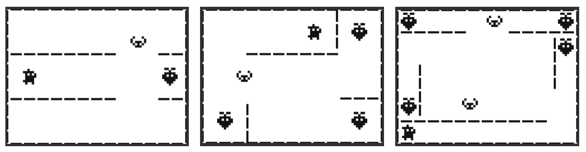

# AllAround
Game made for the ["bitter jam"](https://itch.io/jam/bitter-jam).  
You can play it [here](https://juliaya.itch.io/all-around).  

------   
#### About the jam.   
Bitter Jam is a Game jam hosted by [Bremea](https://bremea.itch.io). 
The idea is really neat: There is no theme, you must make a game with a given tilesheet. 

     
      
------   
#### About the Game.     
I Decided to make a very simple game that should take only around 6 hours or less to develop the main mechanic and then play with it making different stages. The result is a game where you need to collect the fruits on screen while avoiding the creatures that protect it. :)

These are the 3 stages I came up with (not much, I know. But I enjoyed doing it):

